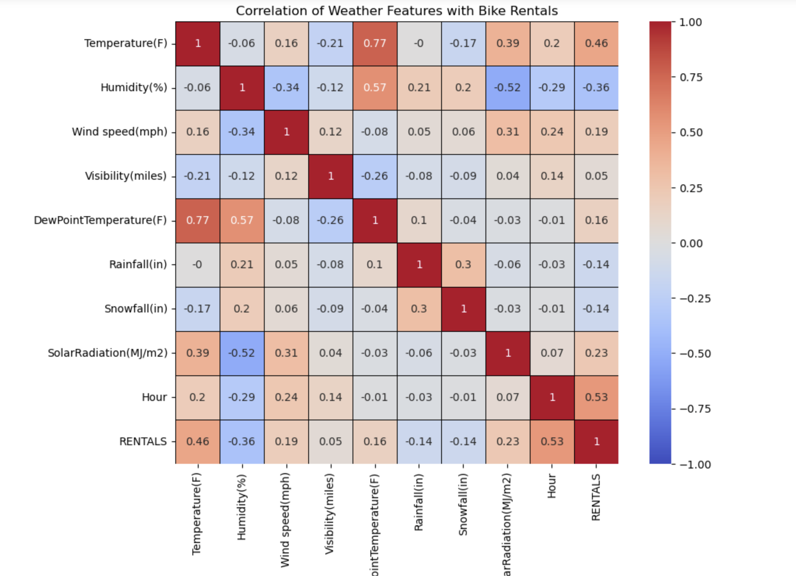
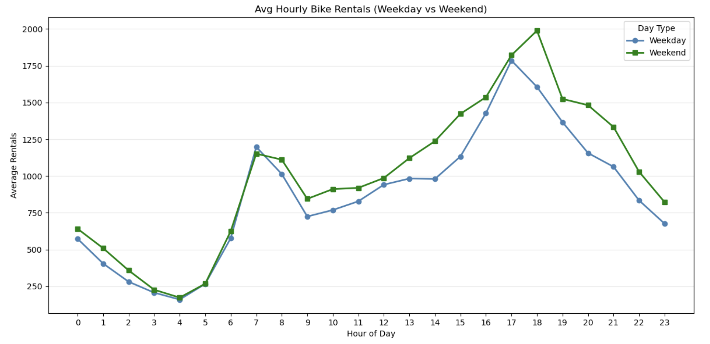

# Bike Rental Demand Analysis

    

Statistical analysis of hourly bike rental demand for an urban bike-share operator, examining how time-of-day, weekday/weekend patterns, and weather-related variables drive rental activity and translating those drivers into operational recommendations for fleet sizing, marketing positioning, and pricing.

  
  &nbsp;
  

---

## Objective

Examine 1,096 hours of operational data (October–December 2023) to answer three board-level questions:

1. **Why are customers renting bikes?**
2. **Are there ideal weather conditions that create demand peaks?**
3. **What strategic implications can be derived for the business?**

Non-operational hours were excluded from the dataset to prevent downtime from masking actual demand behavior.

## Dataset

1,096 hourly observations from October–December 2023, including:

- Rental counts (the dependent variable)
- Weather variables — temperature (°F), humidity (%), wind speed, visibility, dew point, rainfall, snowfall, solar radiation
- Calendar flags — holiday indicator, functioning-day indicator

## Key Insights

- **Demand is leisure-heavy, not commute-heavy.** Rentals peak between 5–7 PM and reach their highest values on weekends — at 6 PM, weekend rentals (1,988/hr) outpace weekdays (1,605/hr) by 24%. The morning commuter spike (7–9 AM) still exists but is the smaller segment. Holidays had only a 4% effect on demand.
- **Ideal weather drives demand 2.23×.** Combined conditions of >60°F, <60% humidity, and no rain generate ~1,446 rentals/hour vs. ~649 in adverse conditions. Temperature correlates with rentals at +0.46, humidity at −0.36. Rain collapses demand from ~927 to ~241 rentals/hour — acting like a switch rather than a gradient.
- **Revenue swing of ~$2,400 per peak hour** between ideal- and adverse-weather conditions (at an assumed $3/rental benchmark), making weather-aware fleet management directly tied to profitability.

## Strategic Recommendations

1. **Time-of-day fleet rebalancing** — deploy 100% of the fleet during the 4–8 PM peak window; scale back overnight
2. **Weather-based fleet sizing** — 100% deployment on forecast-ideal days, 80% on mild and dry days, 60% on cold or rainy days; place maintenance windows on bad-weather days to avoid sacrificing peak-day revenue
3. **Marketing reallocation** — reposition the brand message from "commuter convenience" toward "lifestyle" given the leisure-heavy demand profile
4. **Weather-reactive dynamic pricing** — reduce variance between good- and bad-weather days, particularly if fleet size cannot flex dynamically

## Techniques Used

- **pandas** — data loading, cleaning, filtering, and time-series aggregation
- **matplotlib** and **seaborn** — exploratory data visualization (line plots, bar charts, correlation heatmaps, distribution plots)
- **Categorical bucketing** — converting continuous weather variables into *ideal* and *adverse* categories for comparative analysis
- **Correlation analysis** — quantifying the relationship between weather variables and rental demand
- **Hour-of-day / day-of-week segmentation** — separating commuter from leisure demand patterns

## How to View

The notebook renders directly on GitHub — code, written narrative, charts, and tables all visible in the browser without downloading. To run it locally:

1. Download `bike-rental-demand-analysis.ipynb`
2. Install the dependencies: `pandas`, `matplotlib`, `seaborn`, and `openpyxl` (for the Excel data load)
3. Open in Jupyter Notebook, JupyterLab, or VS Code
